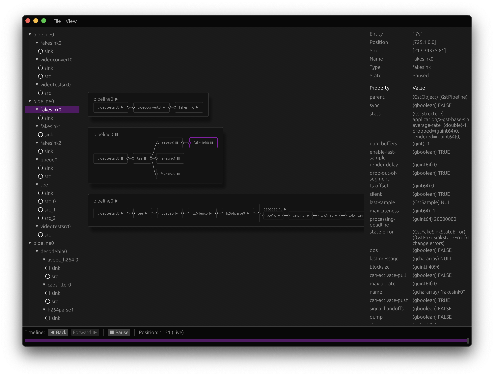

<p align="center">
    
</p>

# Glitch

A compute graph visualiser with a tracer for gstreamer pipelines.

_Disclaimer: this is still very much a work in progress :)_

<p align="center">
    
</p>

Features:

- [x] Pipeline's complete graph with bins subgraphs
- [x] Attach the tracer to any gstreamer-based application
- [ ] Live view of pads content for known caps
- [ ] Timeline of events with topology changes

To use it with your gstreamer pipeline: build all the targets, launch the app (`cargo run --release`)
and start your program with the custom tracer:

```
export GST_PLUGIN_PATH=$PWD/target/release/
GST_TRACERS="glitchtracing" gst-launch-1.0 videotestsrc ! identity ! fakesink
```

If needed, change the ip and port to use for connecting to the app with `GST_TRACERS="glitchtracing(ip=$IP,port=$PORT)"`.

**The quickest way to try the UI is to load [demo_save.ron](./demo_save.ron) from the top menu. No gstreamer required.**

## Development

The viewer app itself doesn't depend on gstreamer and tries to be agnostic
about the kind of compute graph it's visualising. The goal is to be able to
support other frameworks like [vector](https://github.com/vectordotdev/vector)
or [mediapipe](https://github.com/google-ai-edge/mediapipe).

The graph layouting is done by a rough implementation of a [Sugiyama-style algorithm](https://en.wikipedia.org/wiki/Layered_graph_drawing),
it still requires extensive work and may or may not give a pretty output for your use case.

The app's data model is an [ECS](https://en.wikipedia.org/wiki/Entity_component_system) that should allow
for maximum flexibility when used to view the content of different frameworks (it's good enough for [rerun](https://rerun.io/docs/concepts/entity-component) so it'll be for us).
The tracer that is embedded in the actual gstreamer program sends atomic updates to be performed on entities displayed by the app: an element
is an entity with a node component, a name, a state etc. and once it reaches the app a size and a position can be added.

The code is split in-between the following crates:
- `app` the entry point to the app, can dynamically reload the `ui` crate during development when working on the rendering
- `ui` contains (almost) all the egui-related code
- `tracer` is the gstreamer tracer
- `common` contains everything else, in particular the components definitions

### Upgrading gstreamer

The CI uses the tarballs in the repo to install gstreamer. If the version has changed, use the Dockerfile to build
them, install buildx and do:

    docker buildx build \
        --platform linux/arm64,linux/amd64 \
        --target=artifact \
        --output type=local,dest=$(pwd) .
